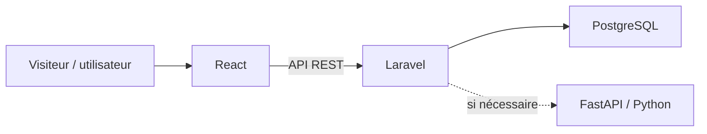

# ATBA — عتبة

<p align="center"><strong>Votre prochain chez-vous commence ici.</strong></p>

<p align="center">
  Plateforme immobilière marocaine de vente et de location entre particuliers.
</p>

<p align="center">
  
  
  
  
</p>

> **Statut du dépôt :** projet en phase de conception. Les fonctionnalités et l'infrastructure ci-dessous décrivent le périmètre prévu ; leur présence dans une version donnée dépend de l'avancement du développement.

## Présentation

**ATBA** signifie « seuil » (عتبة) : le début d'une nouvelle vie dans un logement. Ce projet de stage vise à créer une plateforme où les particuliers peuvent publier, rechercher et comparer des biens immobiliers au Maroc, puis échanger directement pour organiser une visite. Il concerne aussi bien la **vente** que la **location**, sans agence intermédiaire.

La plateforme facilite la mise en relation. Elle ne réalise pas les paiements immobiliers ni les transactions juridiques.

## Objectifs

- Simplifier la recherche de logements grâce à des annonces détaillées et des filtres pertinents.
- Permettre un échange direct entre la personne intéressée et le propriétaire.
- Améliorer la qualité des annonces grâce à la modération, aux signalements et aux informations vérifiables.
- Aider à comparer les biens et à organiser les visites.
- Étudier des recommandations et une aide à la détection d'annonces atypiques.

## Fonctionnalités prévues

### Visiteur

- Parcourir les annonces de vente et de location sans compte.
- Rechercher par ville, quartier, type de bien, prix, surface, chambres et équipements.
- Consulter les photos et les caractéristiques d'un bien.

### Utilisateur connecté

Un **compte unique** donne accès aux deux espaces. Une personne peut publier un bien tout en recherchant un autre logement ; « acheteur », « locataire », « vendeur » et « bailleur » décrivent des usages, pas quatre types de comptes.

| Espace Recherche | Espace Propriétaire |
| --- | --- |
| Recherche, filtres et consultation des annonces | Création et gestion des biens et annonces |
| Favoris, recherches sauvegardées et comparaison | Suivi de l'activité des annonces |
| Messagerie avec le propriétaire | Réponse aux messages reçus |
| Demandes de visite et suivi de leur état | Gestion des demandes de visite |
| Notifications et signalements | Notifications liées aux annonces |

Les biens peuvent notamment être des **appartements, maisons, villas, studios, terrains, bureaux et locaux commerciaux**. Les annonces peuvent contenir description, prix, surface, localisation, équipements et photos.

### Administration

- Modérer les annonces et traiter les signalements.
- Gérer les comptes et, si nécessaire, suspendre un utilisateur.
- Gérer les villes et les types de biens.
- Consulter les statistiques et les alertes liées aux annonces atypiques.

### Confiance et intelligence artificielle

- Afficher des informations factuelles, telles qu'un e-mail vérifié ou la complétude d'une annonce.
- Signaler une annonce suspecte et soumettre le cas à un administrateur.
- Étudier des recommandations fondées d'abord sur un score (budget, ville, type de bien, préférences).
- Détecter des prix ou descriptions atypiques pour aider la modération. **La décision de retirer une annonce reste humaine.**

Une annonce contrôlée ou un profil vérifié ne constitue **pas une certification juridique de propriété**.

## Stack technique prévue

| Couche | Technologie | Rôle |
| --- | --- | --- |
| Frontend | React | Interface visiteur, espaces utilisateur et administration |
| Backend | Laravel | API REST, authentification et logique métier |
| Base de données | PostgreSQL | Stockage relationnel |
| Conception | MERISE (MCD et MLD) | Modélisation des données |
| Conteneurs | Docker et Docker Compose | Environnement reproductible |
| Serveur web | Nginx | Entrée HTTP et routage des services |
| CI/CD | GitHub Actions | Tests, analyses et construction des images |
| IA éventuelle | Python et FastAPI | Service séparé si les besoins le justifient |



## Parcours principaux

1. Un propriétaire crée un compte et publie une annonce de vente ou de location.
2. L'annonce passe par les contrôles et la modération prévus.
3. Une personne recherche un bien, consulte les détails et contacte le propriétaire.
4. Elle demande une visite ; le propriétaire peut l'accepter, la refuser ou proposer un autre créneau.
5. Les deux parties poursuivent leurs échanges directement. Les démarches financières et juridiques se déroulent hors de la plateforme.

## Développement local

Les instructions d'installation exécutables seront ajoutées lorsque la structure du dépôt et les fichiers Docker seront en place. La convention envisagée est un dossier `frontend/` pour React, `backend/` pour Laravel et un `compose.yaml` à la racine ; **ces chemins ne sont pas encore garantis**.

Prérequis envisagés : Git et Docker avec Docker Compose. La configuration devra être copiée depuis des fichiers `.env.example`, sans publier de secrets. Une fois le dépôt créé, cette section précisera les commandes exactes de démarrage, de migration et d'accès à l'application.

## Qualité et sécurité

L'approche DevSecOps prévue intègre :

- Branches de fonctionnalités, Pull Requests et revue de code.
- Tests automatisés du frontend et du backend.
- Validation côté serveur, contrôle des accès et protection des données personnelles.
- Gestion des secrets par variables d'environnement.
- Analyse des dépendances avec `composer audit` et `npm audit` lorsque les projets seront initialisés.
- Analyse de sécurité et vérification des images Docker dans la CI.

Le pipeline GitHub Actions envisagé suit le parcours **lint → tests → audits → build Docker → validation**, puis déploiement selon l'environnement disponible.

## Organisation Git proposée

```text
main                 version stable
develop              intégration des fonctionnalités
feature/<sujet>      développement d'une fonctionnalité
fix/<sujet>          correction ciblée
```

Les contributions passent par une branche dédiée, des tests adaptés et une Pull Request vers `develop`. Cette convention peut évoluer avec les besoins du stage.

## Design

L'interface visée est sobre et accueillante : **blanc, beige clair et noir**, avec un accent **terre cuite** inspiré du seuil et de l'architecture marocaine. Le logo ATBA et l'écriture arabe عتبة servent de point de départ ; les variantes finales seront adaptées aux usages web et mobiles.

## Réalisation

Projet de stage conçu et développé par **Soukayna Zaidi**, étudiante en **3e année de Génie Informatique**, encadrée par **M. El Achak Lotfi**.

## Licence

Licence à définir. Aucune autorisation de réutilisation n'est présumée tant qu'un fichier de licence n'est pas ajouté au dépôt.
